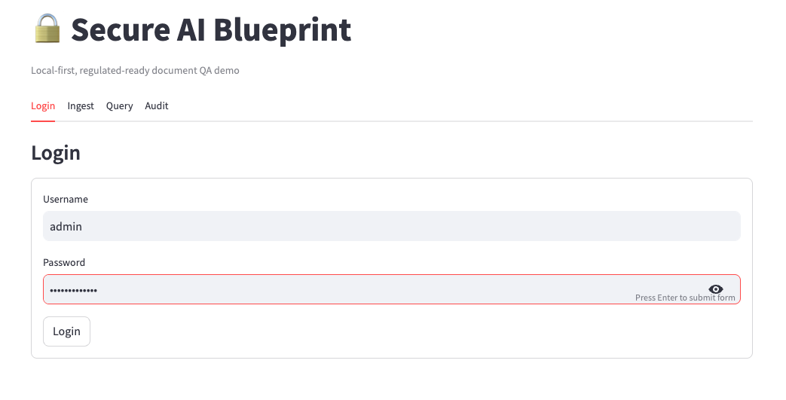
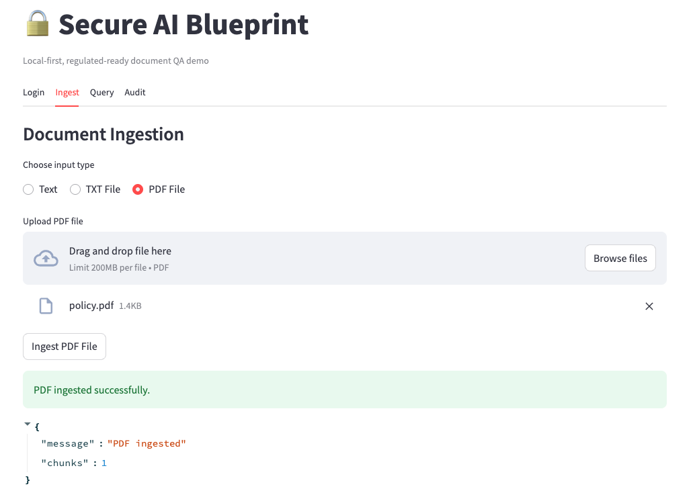
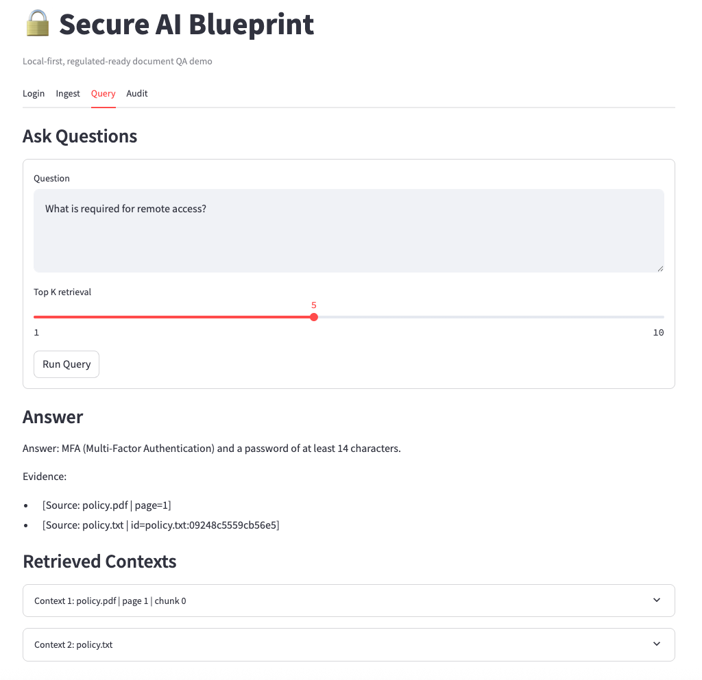
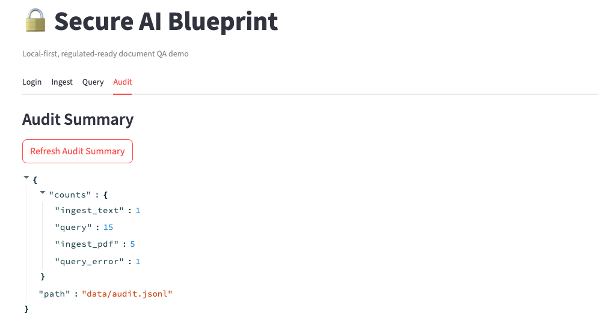

# Secure AI Blueprint (Lean V1)

A local-first, regulated-ready RAG reference implementation for secure AI deployment.

## Current capabilities
- Local LLM inference with Ollama
- TXT and PDF ingestion
- Local embeddings and Chroma vector store
- JWT authentication
- RBAC for admin/user roles
- Audit logging
- Source-grounded responses

## Lean V1 architecture

```text
                 +----------------------+
                 |   Admin / User CLI   |
                 |  curl / Swagger UI   |
                 +----------+-----------+
                            |
                            v
                 +----------------------+
                 |     FastAPI API      |
                 |  Auth / RBAC / RAG   |
                 +----+-----------+-----+
                      |           |
          ingest txt/pdf          | query
                      |           |
                      v           v
             +---------------------------+
             |   Chunking + Embeddings   |
             | sentence-transformers     |
             +-------------+-------------+
                           |
                           v
                 +----------------------+
                 |   Chroma Vector DB   |
                 |   local persistence  |
                 +----------+-----------+
                            |
                            v
                 +----------------------+
                 |      Ollama LLM      |
                 |   local generation   |
                 +----------------------+

Supporting controls:
- JWT-based authentication
- Role-based access control
- Local JSONL audit logs
- .env-based secret configuration
- Local-only deployment model


```
## Regulated-environment design goals

This project is intentionally designed around foundational controls often needed in regulated environments:

- **Data locality**: documents, embeddings, vector store, and model inference remain local
- **Access control**: role-gated endpoints for ingestion and audit access
- **Auditability**: structured event logging for ingestion and query activity
- **Configurability**: secrets and runtime settings are externalized via environment variables

## Current limitations

Lean V1 is intentionally minimal and does not yet include:
- SSO / OIDC integration
- encryption at rest
- PII redaction
- multi-tenancy
- policy enforcement workflows
- production-grade observability

## API endpoints

- `POST /auth/login` — get JWT token
- `POST /ingest/text` — ingest text content (admin only)
- `POST /ingest/file` — ingest `.txt` file (admin only)
- `POST /ingest/pdf` — ingest PDF file (admin only)
- `POST /query` — retrieve grounded answer from local knowledge base
- `GET /audit/summary` — view audit event counts (admin only)
- `GET /health` — health check

## Why this project exists

Many AI demos are notebook-first and API-dependent. This project takes a different approach: it demonstrates a local-first AI retrieval architecture with security and governance primitives that are more relevant to real enterprise and regulated use cases.

## Project intro

```markdown
# Secure AI Blueprint

A **local-first secure Retrieval-Augmented Generation (RAG) system** designed for regulated environments.

The project demonstrates how to build AI document assistants with:

- authentication
- role-based access control
- audit logging
- PII-safe logging
- grounded document answers
- local LLM inference

All components run locally.

## Demo

### Login


### Document Ingestion


### Query Answer


### Audit Summary


## Architecture

Lean V1 architecture:

## Architecture

Lean V1 architecture:


## Features

- JWT authentication
- Role-based access control
- Text and PDF document ingestion
- Local embeddings using Sentence Transformers
- Vector search using Chroma
- Local LLM inference with Ollama
- Grounded answers with source attribution
- Retrieval relevance filtering
- PII redaction for audit logs
- Structured operational logging
- Streamlit demo UI

## Quick Start

### Start API

```bash
uvicorn backend.main:app --reload --host 127.0.0.1 --port 8000

streamlit run backend/app_ui.py

http://localhost:8501

