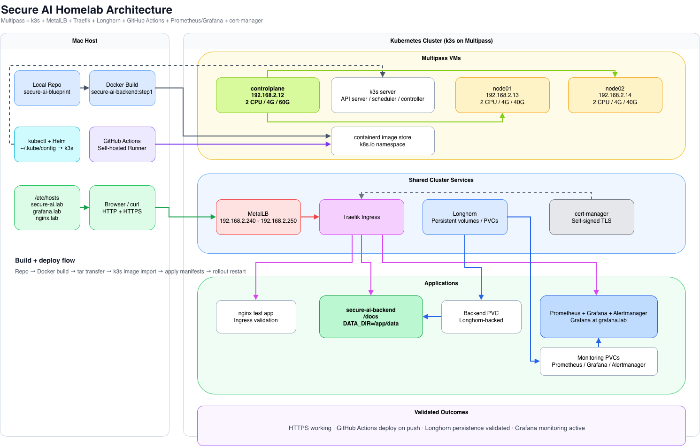
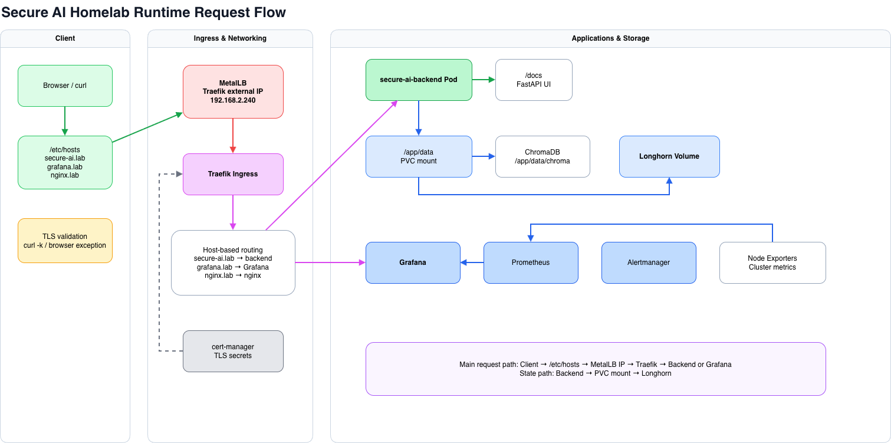
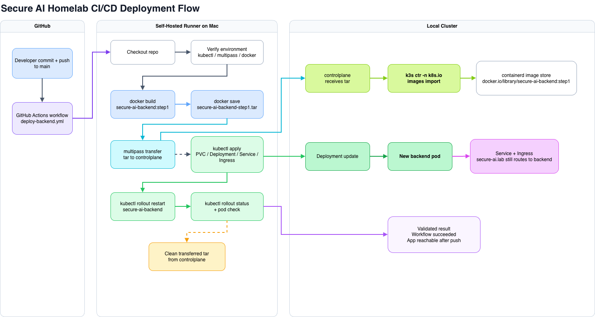
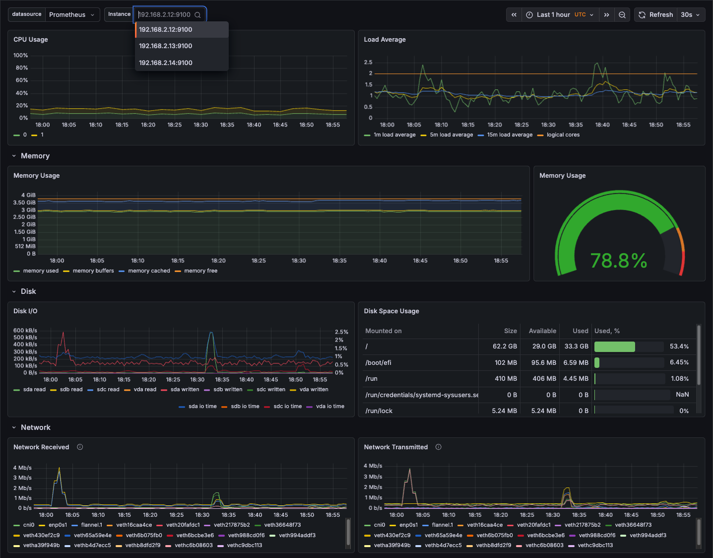

# 🚀 Secure AI Homelab

> Production-style AI platform built locally using Kubernetes (k3s) on Multipass, with full CI/CD, storage, ingress, TLS, and observability.

---

## 🔍 Overview

This project demonstrates how to design and operate a **cloud-native AI application platform** entirely on a local machine — replicating real-world production patterns **without relying on public cloud infrastructure**.

It combines:
- Kubernetes (k3s)
- CI/CD automation (GitHub Actions)
- Persistent storage (Longhorn)
- Ingress networking (MetalLB + Traefik)
- TLS security (cert-manager)
- Observability (Prometheus + Grafana)
- AI backend (FastAPI + RAG pipeline)

---

## 🧠 Why This Project

Modern AI platforms require:
- scalable infrastructure  
- reliable deployments  
- persistent data storage  
- observability  
- secure access  

This project simulates a **real production environment on a laptop** to:

- Validate architecture decisions  
- Build end-to-end DevOps workflows  
- Debug real-world failure scenarios  
- Demonstrate platform engineering expertise  

---

## 🏗️ Architecture

<p align="center">
  
</p>

---

## 🔄 Runtime Request Flow

<p align="center">
  
</p>

---

## ⚙️ CI/CD Deployment Flow

<p align="center">
  
</p>

---

## 🚀 Features

- ✅ End-to-end automated CI/CD pipeline  
- ✅ Kubernetes-based architecture (k3s)  
- ✅ Persistent storage (Longhorn)  
- ✅ HTTPS-enabled ingress  
- ✅ Full observability stack (Grafana + Prometheus)  
- ✅ Self-hosted GitHub runner  
- ✅ No container registry required (containerd import)  
- ✅ Production-like environment on local machine  

---

## 📸 Application Screenshots

### Login


### Document Ingestion


### Query & RAG


### Audit


### Monitoring (Grafana)


---

## 🧪 Quick Start

### Create cluster

```bash
multipass launch 22.04 --name controlplane --cpus 2 --memory 4G --disk 60G
multipass launch 22.04 --name node01 --cpus 2 --memory 4G --disk 40G
multipass launch 22.04 --name node02 --cpus 2 --memory 4G --disk 40G
```

### Install k3s

```bash
curl -sfL https://get.k3s.io | sh -
```

### Configure kubectl

```bash
multipass transfer controlplane:/etc/rancher/k3s/k3s.yaml ~/.kube/config
```

### Deploy infrastructure

```bash
kubectl apply -f deploy/k8s/
```

---

## 🌐 Access

Update `/etc/hosts`:

```
192.168.2.240 secure-ai.lab grafana.lab nginx.lab
```

Access:

- Backend: https://secure-ai.lab/docs  
- Grafana: https://grafana.lab  

---

## 📄 Sample Data

Example documents used for ingestion and query testing:

- docs/sample-data/sample-policy.pdf  
- docs/sample-data/sample-policy.txt  

These demonstrate multi-format ingestion and evidence-based retrieval.

---

## 📁 Repository Structure

```
secure-ai-blueprint/
├── backend/
├── deploy/k8s/
├── script/
├── docs/
│   ├── diagrams/
│   ├── screenshots/
│   ├── sample-data/
│   └── runbooks/
├── .github/workflows/
├── Dockerfile.backend
├── .env.example
└── README.md
```

---

## ⚠️ Challenges & Learnings

- Disk pressure from large images  
- ErrImageNeverPull debugging  
- Containerd namespace handling  
- Read-only filesystem issues  
- Local DNS resolution challenges  
- Dependency management for AI libraries  

---

## 🔮 Future Improvements

- Private container registry  
- Horizontal Pod Autoscaling (HPA)  
- Service mesh (Istio / Linkerd)  
- Secrets management (Vault)  
- Multi-tenant RBAC  

---

## 👤 Author

**Ramana Sonti**  
Senior Technology Consultant | AI / Cloud Platform Engineering  

---

## ⭐ Key Takeaway

This project demonstrates:

- Cloud-native system design  
- Kubernetes platform engineering  
- CI/CD automation  
- AI application deployment  
- Real-world troubleshooting  

---

> 💡 Built to mirror production systems — not just a demo.
