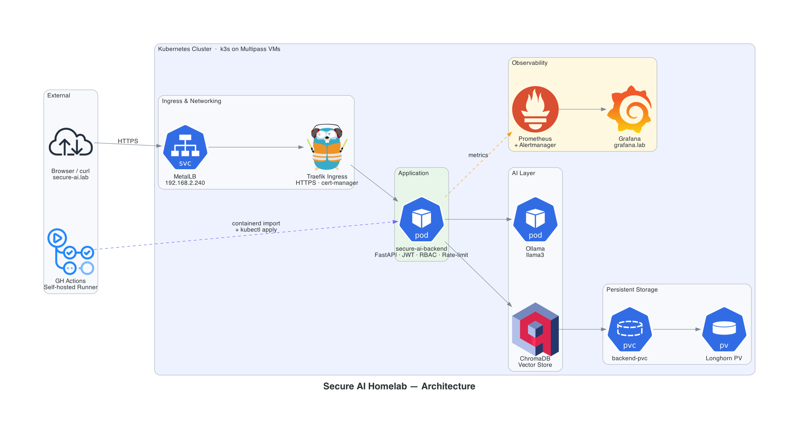
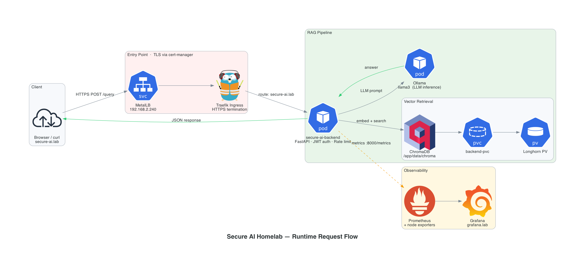
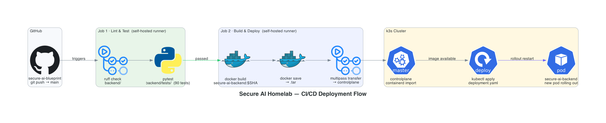
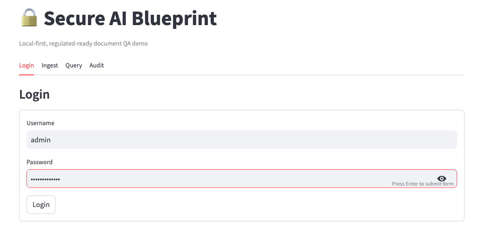
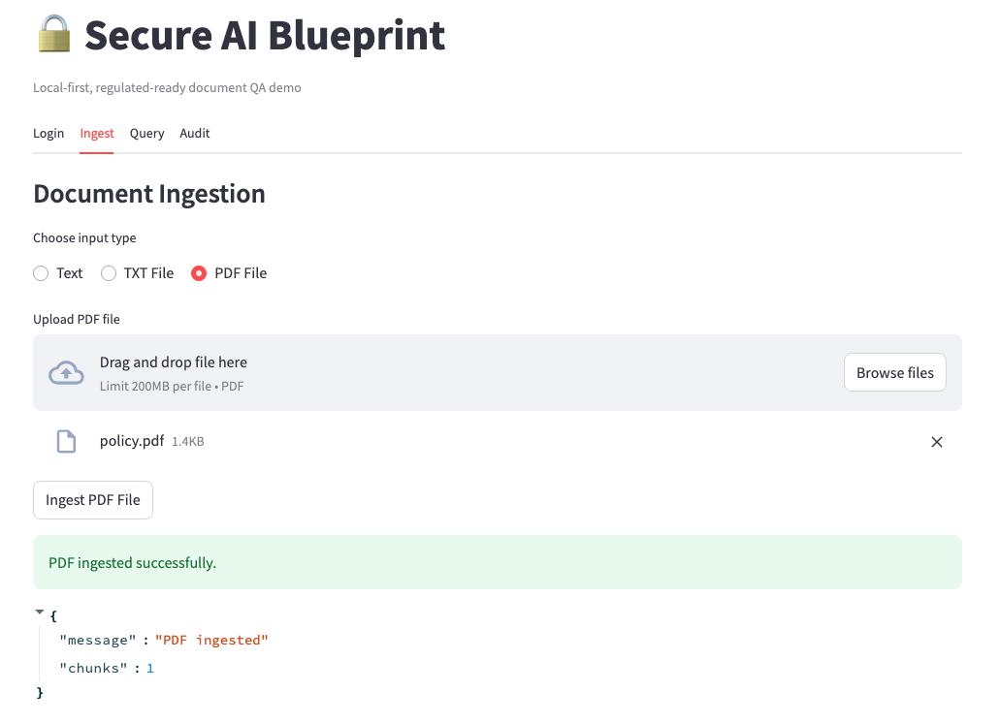
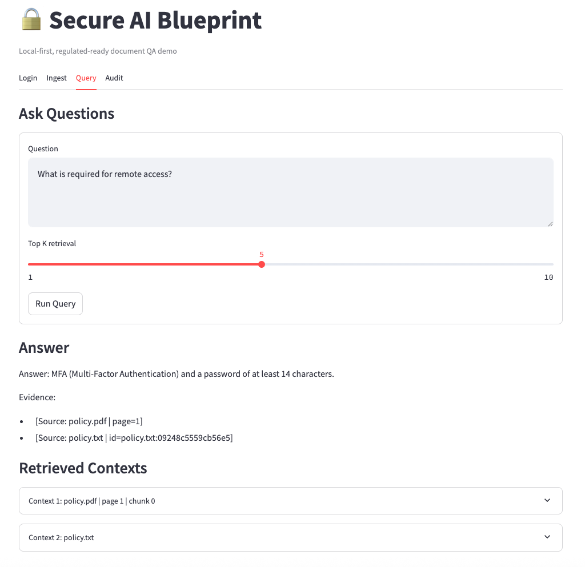
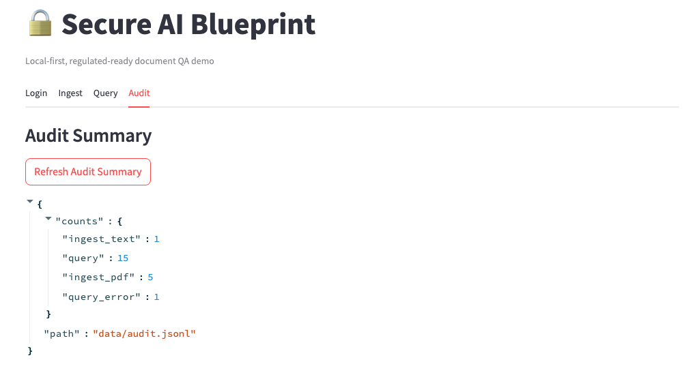
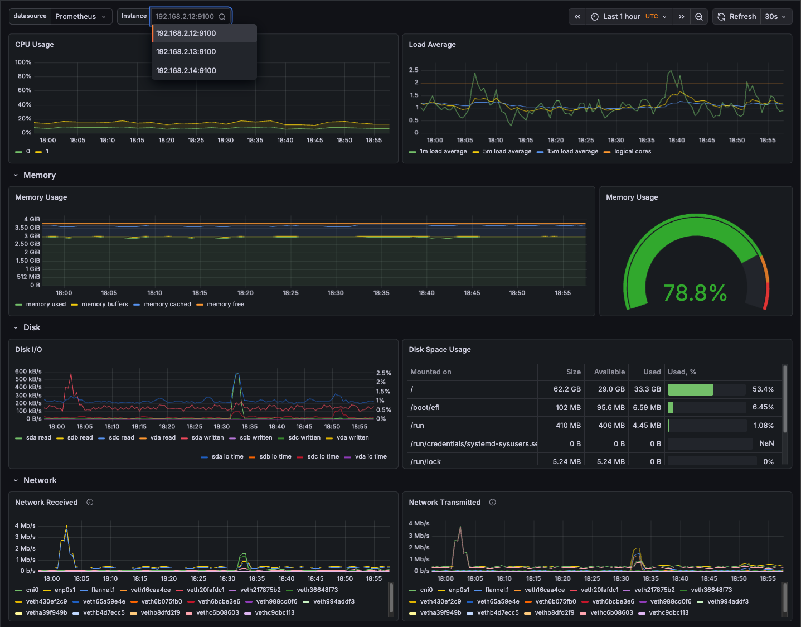

# 🚀 Secure AI Homelab

> Production-style AI platform built locally using Kubernetes (k3s) on Multipass, with full CI/CD, storage, ingress, TLS, and observability.

---

## 🔍 Overview

This project demonstrates how to design and operate a **cloud-native AI application platform** entirely on a local machine — replicating real-world production patterns **without relying on public cloud infrastructure**.

It combines:
- Kubernetes (k3s)
- CI/CD automation (GitHub Actions)
- Persistent storage (Longhorn)
- Ingress networking (MetalLB + Traefik)
- TLS security (cert-manager)
- Observability (Prometheus + Grafana)
- AI backend (FastAPI + ChromaDB + sentence-transformers + Ollama/llama3)
- Streamlit frontend deployed as a k8s service

---

## 🧠 Why This Project

Modern AI platforms require:
- scalable infrastructure  
- reliable deployments  
- persistent data storage  
- observability  
- secure access  

This project simulates a **real production environment on a laptop** to:

- Validate architecture decisions  
- Build end-to-end DevOps workflows  
- Debug real-world failure scenarios  
- Demonstrate platform engineering expertise  

---

## 🏗️ Architecture

<p align="center">
  
</p>

---

## 🔄 Runtime Request Flow

<p align="center">
  
</p>

---

## ⚙️ CI/CD Deployment Flow

<p align="center">
  
</p>

> Diagrams are generated from Python scripts in [`docs/diagrams/source/`](docs/diagrams/source/) using the [`diagrams`](https://diagrams.mingrammer.com/) library. Run any `gen_*.py` script from the repo root to regenerate.

---

## 🚀 Features

**Infrastructure**
- ✅ Kubernetes-based architecture (k3s on Multipass VMs)
- ✅ Persistent storage (Longhorn)
- ✅ HTTPS-enabled ingress (MetalLB + Traefik + cert-manager TLS)
- ✅ Full observability stack (Prometheus + Grafana + Alertmanager)
- ✅ Application-level alert rules (backend down, crash-looping, high memory, frontend down)
- ✅ Namespace isolation (`secure-ai`)

**CI/CD**
- ✅ Separate CI/CD pipelines for backend and frontend (GitHub Actions)
- ✅ Self-hosted GitHub runner with branch protection (required status checks)
- ✅ Lint → test → build → deploy gating (deploy blocked if tests fail)
- ✅ Pull request checks on `ubuntu-latest`; deploy runs on self-hosted runner (main only)
- ✅ VM preflight check — deploy fails fast if any Multipass VM is stopped
- ✅ No container registry required (containerd image import via multipass)

**Application Security**
- ✅ JWT authentication with PBKDF2-SHA256 password hashing
- ✅ Role-based access control (admin / user)
- ✅ Rate limiting on auth endpoint (in-memory sliding window — 10 req/min per IP)
- ✅ Append-only JSONL audit log with PII redaction
- ✅ Liveness (`/health`) and readiness (`/ready`) probes

**AI / RAG**
- ✅ Document ingestion (.txt, .md, .pdf) with paragraph-aware chunking
- ✅ Vector search via ChromaDB (sentence-transformers/all-MiniLM-L6-v2)
- ✅ LLM synthesis via Ollama (llama3) using structured chat API
- ✅ Streamlit UI deployed as a dedicated k8s service at https://secure-ai-ui.lab

**Quality**
- ✅ 90-test suite covering RAG pipeline, auth, PII redaction, and all API endpoints
- ✅ Ruff linting enforced in CI
- ✅ Lightweight CI test environment (no ChromaDB/sentence-transformers download)

---

## 📸 Application Screenshots

### Login


### Document Ingestion


### Query & RAG


### Audit


### Monitoring (Grafana)


---

## 🧪 Quick Start

### Create cluster

```bash
multipass launch 22.04 --name controlplane --cpus 2 --memory 4G --disk 60G
multipass launch 22.04 --name node01 --cpus 2 --memory 4G --disk 40G
multipass launch 22.04 --name node02 --cpus 2 --memory 4G --disk 40G
```

### Install k3s

```bash
curl -sfL https://get.k3s.io | sh -
```

### Configure kubectl

```bash
multipass transfer controlplane:/etc/rancher/k3s/k3s.yaml ~/.kube/config
```

### Deploy backend

```bash
bash script/deploy_backend.sh
```

### Deploy frontend

```bash
bash script/deploy_frontend.sh
```

Both scripts build the Docker image locally, transfer it to all 3 cluster nodes via `multipass`, import it into containerd, and roll out the k8s deployment.

---

## 🌐 Access

Update `/etc/hosts`:

```
192.168.2.240 secure-ai.lab secure-ai-ui.lab grafana.lab nginx.lab
```

Access:

- **UI**: https://secure-ai-ui.lab
- **Backend API**: https://secure-ai.lab/docs  
- **Grafana**: https://grafana.lab  

---

## 📄 Sample Data

Example documents used for ingestion and query testing:

- docs/sample-data/sample-policy.pdf  
- docs/sample-data/sample-policy.txt  

These demonstrate multi-format ingestion and evidence-based retrieval.

---

## 📁 Repository Structure

```
secure-ai-blueprint/
├── backend/          # FastAPI app, RAG pipeline, auth, audit
├── frontend/         # Streamlit UI (deployed as k8s service)
├── deploy/k8s/
│   ├── backend/      # Deployment, service, ingress, PVC, secret
│   ├── frontend/     # Deployment, service, ingress
│   ├── monitoring/   # PrometheusRule alerts, Helm values for kube-prometheus-stack
│   └── cert-manager/ # ClusterIssuer for TLS
├── script/
│   ├── deploy_backend.sh   # Build, transfer to all nodes, rollout
│   └── deploy_frontend.sh  # Build, transfer to all nodes, rollout
├── docs/
│   ├── diagrams/
│   ├── screenshots/
│   ├── sample-data/
│   └── runbooks/
├── .github/workflows/
│   ├── deploy-backend.yml   # Lint + test + deploy for backend
│   └── deploy-frontend.yml  # Lint + deploy for frontend
├── Dockerfile.backend
├── .env.example
└── README.md
```

---

## ⚠️ Challenges & Learnings

- Disk pressure from large ML images (5.3 GB → 1.5 GB via CPU-only PyTorch)
- `ErrImageNeverPull` on worker nodes when image only transferred to controlplane
- RWO volume `Multi-Attach` errors with rolling deployments (fixed with `Recreate` strategy)
- RAG retrieval returning no results due to overly tight cosine similarity threshold
- LLM echoing raw context instead of synthesizing (fixed by switching to `/api/chat`)
- Character-based chunking splitting mid-word (fixed with boundary-aware chunking)
- CI deploy failing silently after 1m+ SSH timeout when Multipass VMs were stopped
- Self-hosted runner offline causing queued jobs to cancel after 24h
- GitHub Actions Node.js 20 deprecation requiring action version bumps before June 2026
- Containerd namespace handling
- Local DNS resolution challenges
- Dependency management for AI libraries

---

## 🔮 Future Improvements

- Private container registry  
- Horizontal Pod Autoscaling (HPA)  
- Service mesh (Istio / Linkerd)  
- Secrets management (Vault)  
- Multi-tenant RBAC  

---

## 👤 Author

**Ramana Sonti**  
Senior Technology Consultant | AI / Cloud Platform Engineering  

---

## ⭐ Key Takeaway

This project demonstrates:

- Cloud-native system design  
- Kubernetes platform engineering  
- CI/CD automation  
- AI application deployment  
- Real-world troubleshooting  

---

> 💡 Built to mirror production systems — not just a demo.
